## 前言

​	如果有一台具有英伟达显卡的电脑，且系统是Windows，那么可以在本机上搭建CUDA开发环境来进行GPU编程，下面是在windows11上搭建CUDA开发环境和运行程序的示例。

## 实验环境

操作系统：Windows11

显卡：GTX 3060（或其他）

使用软件：Visual Studio 、CUDA Toolkit

编程语言：C、C++、CUDA

## 搭建环境

#### 1. 安装Visual Studio 2022

##### 1. 下载

由于本系统是Windows 11，Visual Studio 2022更加合适。在以下网站上下载社区版。

https://visualstudio.microsoft.com/zh-hans/downloads/

##### 2. 安装与配置

双击下载好的exe文件等待安装。

配置时选择默认配置即可，建议安装位置选在默认安装位置。

#### 2.  安装CUDA Toolkit

##### 1. 下载

首先需要查看自己电脑上的显卡信息以及显卡驱动版本，可以通过`nvidia-smi` 来获得：

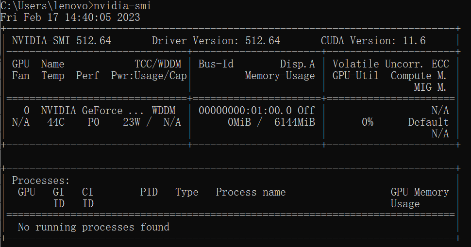

可以看到驱动版本为512.64，那么通过下图来获得对应的toolkit版本：

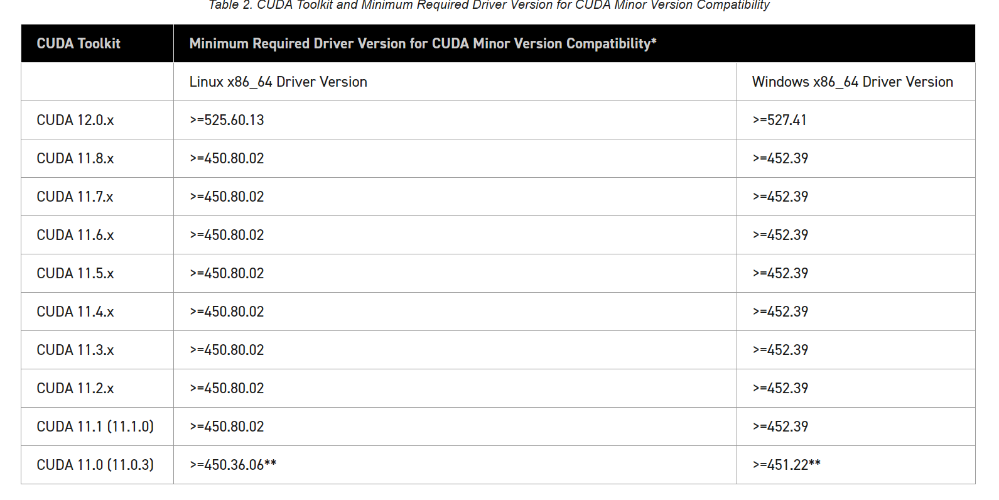

可以看到需要CUDA 11.8版本。

我们需要在 https://developer.nvidia.com/cuda-toolkit-archive 下载对应版本的CUDA Toolkit

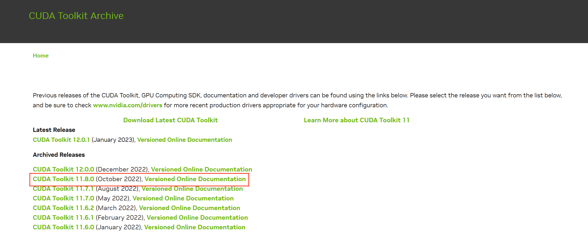

##### 2. 安装与配置

1. 点击exe文件，选择安装位置，推荐默认位置：

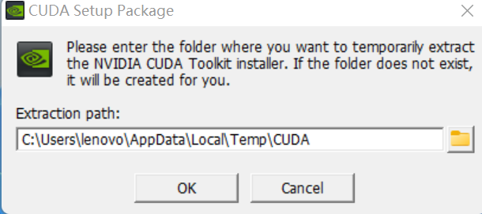

2. 之后会进入系统检查，检查完成后同意软件许可协议。
3. 安装选项

如果你是第一次安装，尽量选择自定义安装

如果你是第n次安装，尽量只选择第一个，不然会出现错误

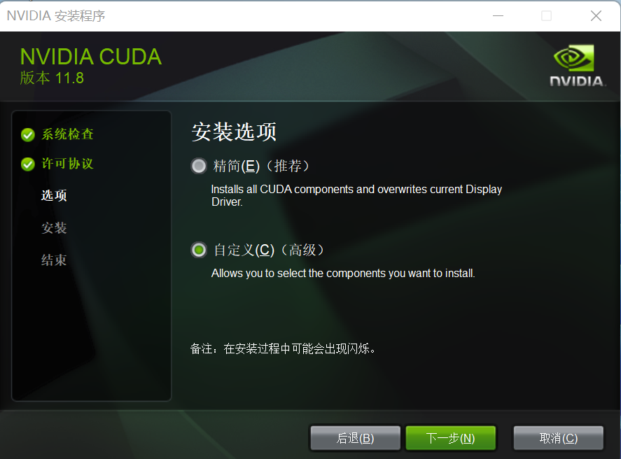

选择则定义安装的话需要选择驱动程序组件，尽量全选。

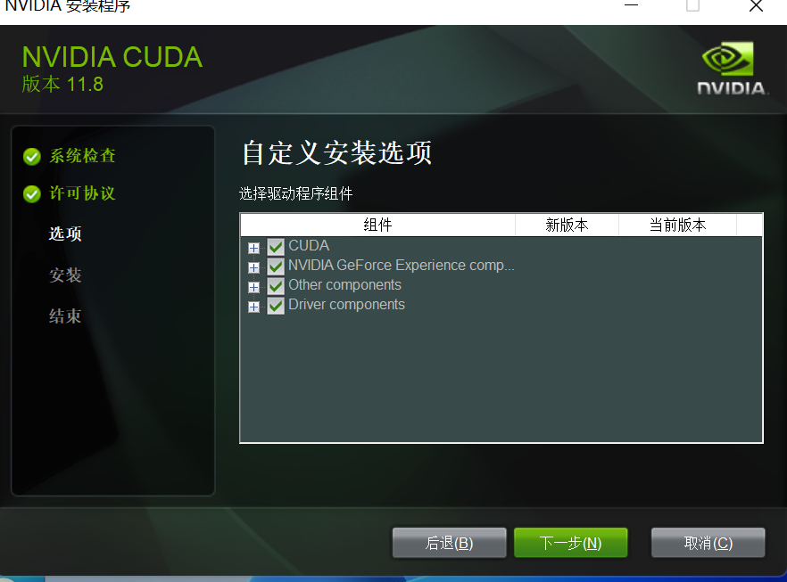

之后选择安装位置，需要记录下来安装位置：

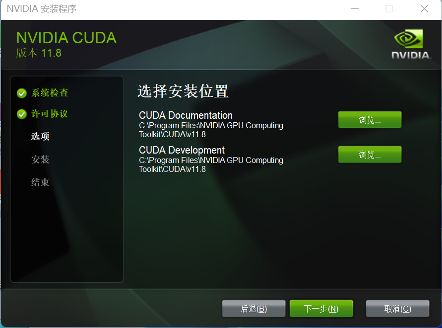

4. 进入安装界面。

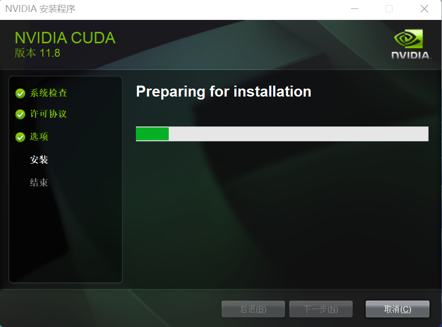

等待安装成功

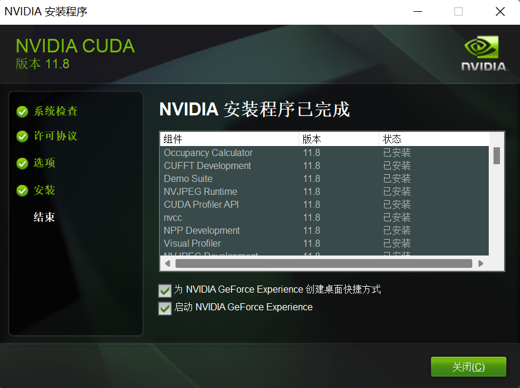

5. 需要在高级系统设置中查看环境变量，是否添加了路径。如果没有需要根据刚刚记录的安装位置进行添加。

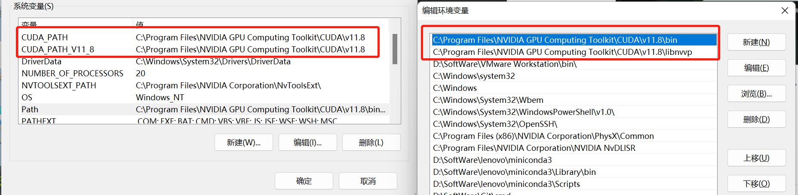

6. 在cmd中输入`nvcc -V`进行验证

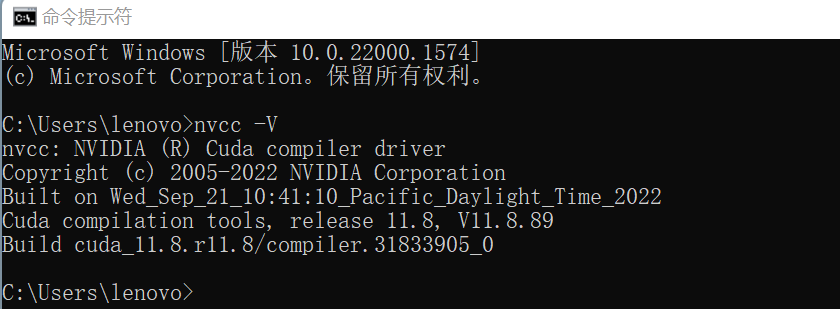

至此，CUDA Toolkit 已经安装与配置成功。

需要注意的是需要先安装VS 后再安装CUDA toolkit，这样在安装CUDA toolkit时会把Nsight程序安装到VS中，并把CUDA编译器转移至VS对应目录。如果安装反了，请再次安装CUDA toolkit.

### 编译运行

打开VS，创建新项目，选择CUDA Runtime模板

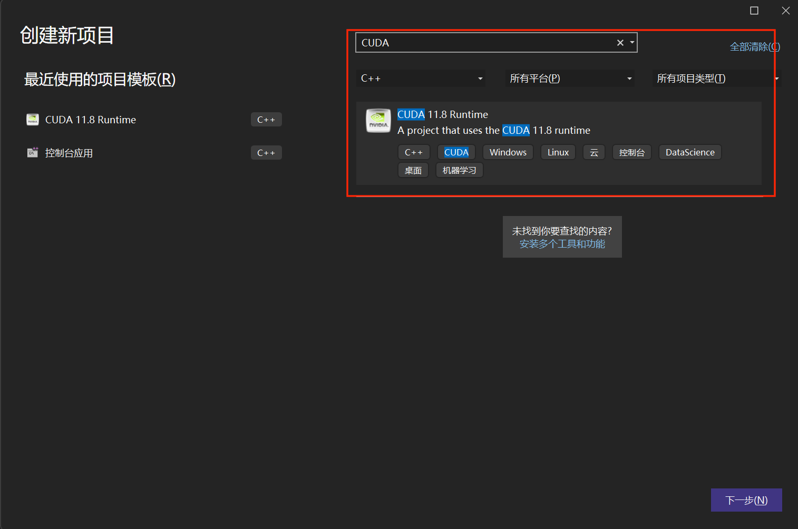

在工程文件中写入代码之后点击运行即可。

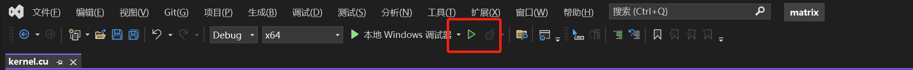