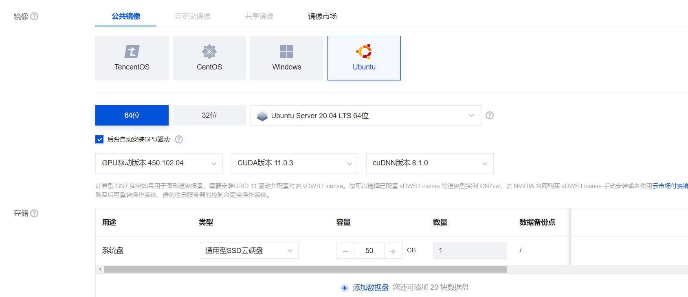
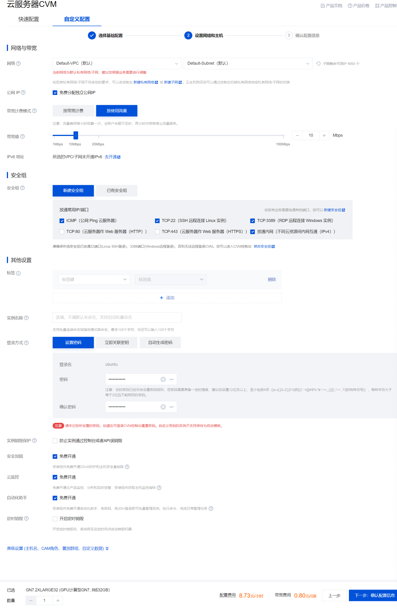

### 前言

​	如果没有一台支持 OpenCL 的个人电脑，可以租用带有支持 OpenCL 的独立显卡服务器进行实验，下面是在购买服务器与搭建环境后的编译、运行流程。

### 环境

本次实验在购买的带有支持 OpenCL 的显卡服务器进行实验（有条件也可以在本地进行实验），操作系统为 Ubuntu 20.04 LTS，显卡驱动和 OpenCL 运行时需根据所选 GPU（如 NVIDIA、AMD 或 Intel）安装对应版本。编程语言为 C 或 C++，使用 OpenCL 进行并行计算。

### 购买服务器与搭建环境

##### 购买服务器

本实验可以直接在云服务平台（如腾讯云、阿里云等）中购买带有独立显卡的服务器，建议选择支持 OpenCL 的 GPU，并根据需求选择合适的配置。


可参考配置如下：






配置成功后远程连接。

##### 验证 OpenCL 是否安装

可以使用 `clinfo` 工具来检测 OpenCL 环境是否安装成功。

安装 clinfo：

```
sudo apt-get install clinfo
```

运行 clinfo：

```
clinfo
```

如果能正确显示设备信息，说明 OpenCL 环境已安装成功。

##### 安装 cmake 与验证是否安装

安装：

```
sudo apt-get install cmake
```

验证：

```
cmake --version
```


##### 安装 OpenCL 开发环境

根据显卡类型选择安装对应的 OpenCL SDK 和驱动。例如：

- **NVIDIA GPU**：安装 NVIDIA 驱动和 CUDA Toolkit（包含 OpenCL 支持）
- **AMD GPU**：安装 AMDGPU 驱动和 ROCm/OpenCL SDK
- **Intel GPU/CPU**：安装 Intel OpenCL Runtime

以 NVIDIA 为例，安装 CUDA Toolkit（包含 OpenCL）：

```
sudo apt-get install nvidia-cuda-toolkit
```

或者根据实际情况下载并安装对应厂商的 OpenCL SDK。

##### 设置环境变量

根据 OpenCL SDK 的安装路径设置环境变量（如有需要），例如：

```
export LD_LIBRARY_PATH=/usr/local/cuda/lib64:$LD_LIBRARY_PATH
```

并通过以下指令查看是否设置成功：

```
echo $LD_LIBRARY_PATH
```

#### 编译与运行

假设有 OpenCL 项目的构建脚本，直接运行：

```
sh opencl_linux_run.sh
```

或根据项目文档使用 cmake/make 进行编译和运行。
