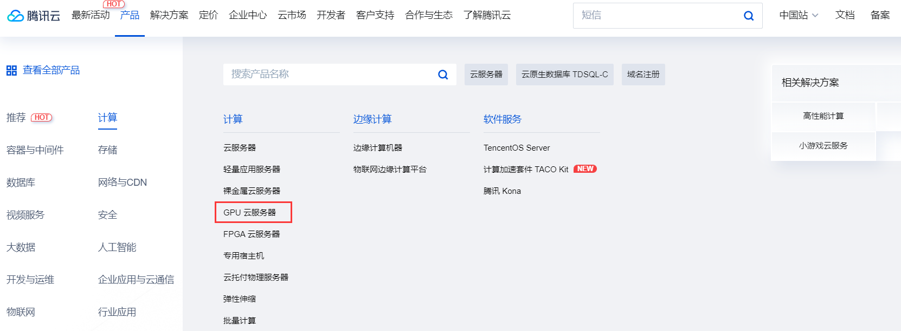
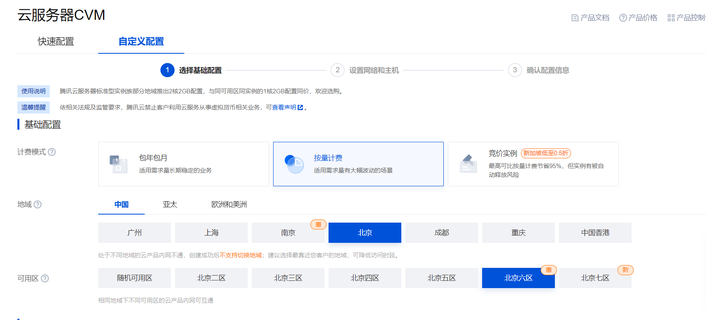
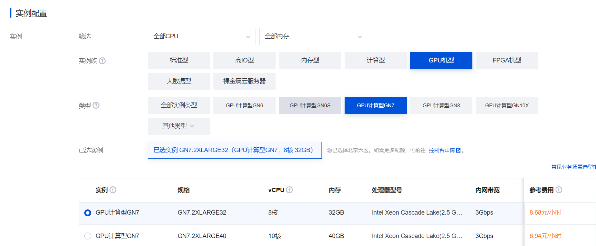
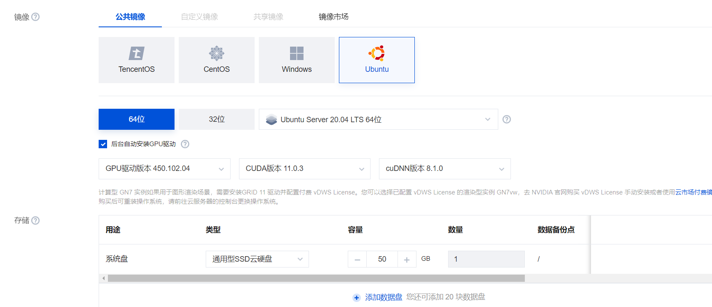
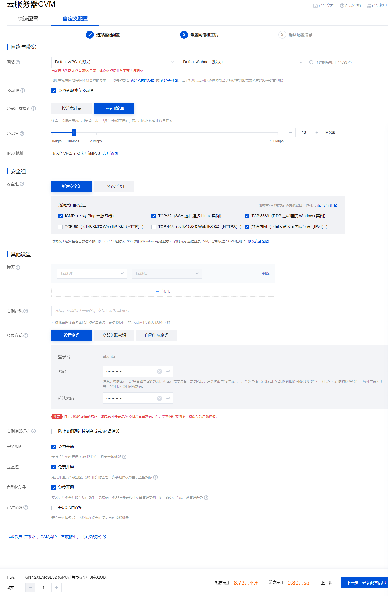
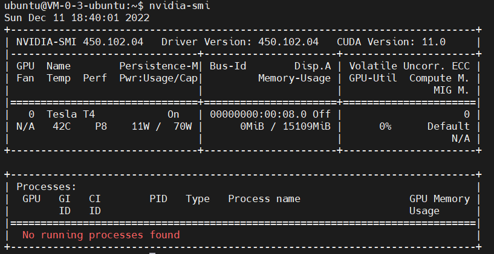

### 前言

​	如果没有一台英伟达显卡的个人电脑，可以租用带有独显的服务器进行实验，下面是在购买服务器与搭建环境后的编译、运行流程。

### 环境

本次实验在购买的带有英伟达显卡的服务器进行实验（有条件也可以在本地进行实验），操作系统是Ubuntu 20.04 LTS ， GPU驱动版本450.102.04，CUDA版本11.0.3，cuDNN版本8.1.0（版本不同不影响实验），编程语言C，Ｃ＋＋，CUDA

### 购买服务器与搭建环境

##### 购买服务器

本实验可以直接在腾讯云中购买自动安装GPU驱动与CUDA的服务器



可参考配置如下：









配置成功后远程连接。

##### 验证 cuda是否安装

```
nvidia-smi
```



说明已经安装成功。

##### 安装cmake 与验证是否安装

安装：

```
sudo apt-get install cmake
```

验证：

```
cmake --version
```


##### 设置CMAKE_CUDA_COMPILER 环境变量

通过自己服务器中`/usr/local/`文件夹下的`cuda` 版本来设置环境变量

```
 export PATH=/usr/local/cuda-10.1/bin/:$PATH
```

并通过一下指令查看是否设置成功

```
export
```

#### 编译与运行

以此编译并进行执行

```
cmake ./
```

```
make
```

```
./test
```

### 