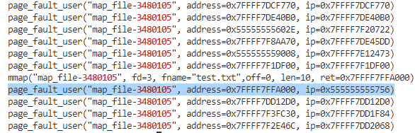

mmap_pagefault_snoop.bt: bpftrace程序，使用eBPF观察调用mmap时发生的page fault事件

pipe.c: 使用无名管道进行进程通信

faults.py: 运行mmap_pagefault_snoop.bt，观测mmap的结果

straceout.txt: 使用strace统计pipe.c调用write的结果

## eBPF观测实验步骤
- 下载bpftrace的代码：
```
git clone https://github.com/iovisor/bpftrace
```
- bpftrace支持基于Docker的编译，配置Docker环境后，直接执行编译脚本：
```
./build.sh
```
- 编译成功后将bpftrace安装到本地：
```
sudo cp ./build-release/src/bpftrace /usr/local/bin
```
- 定义mmap系统调用为hook来观测page fault：
```
sudo bpftrace -l '*syscalls*mmap*'  -v
```
- 编写相关的bpftrace程序(mmap_pagefault_snoop.bt)告诉内核在发生指定 “事件” 时执行对应的代码，这里指定发生page fault时输出相应的命令、进程号、地址和ip。使用bpftrace来观测mmap系统调用的page fault事件，运行该bpftrace程序，并同时运行观测的程序，将观测结果输出到faults.py文件中：
```
sudo bpftrace mmap_pagefault_snoop.bt > faults.py
```
- 实验结果如下图，所要观察的程序的进程号为3550795：


